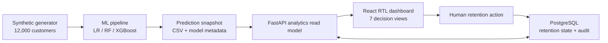

# LTT Predictive Customer Churn Dashboard

نظام دعم قرار تنبؤي عربي أولًا لفرق الإدارة وCustomer Experience وMarketing وCustomer Care وNetwork Operations وBI. يحدد العملاء الأكثر عرضة للمغادرة، يشرح أسباب الخطر، يحسب الإيراد المعرض، ويربط كل حالة ذات أولوية بإجراء Retention قابل للتنفيذ.

> **تنبيه:** كل البيانات الحالية اصطناعية وتجريبية. لا تمثل عملاء LTT أو أداءها أو إيراداتها الحقيقية.

## Overview in English

An Arabic-first (RTL) predictive churn decision-support system for a Libyan telecom context, built end-to-end on clearly labeled synthetic data. Three classifiers (Logistic Regression, Random Forest, XGBoost) are compared and a champion is selected on ROC-AUC, Recall, and Precision — never accuracy alone. Predictions become a 0–100 risk score in four business bands, explained globally (SHAP) and per customer (three plain-language reason codes), then converted into money (Revenue at Risk) and into action: a retention queue ranked by `churn probability × customer value × retention probability`, with a recommended intervention and an owning team for every High/Critical case.

**Stack:** React 19 · TypeScript · Vite · Recharts | FastAPI · pandas · scikit-learn · XGBoost · SHAP | PostgreSQL | Docker Compose · Nginx

**Quickstart:** copy `.env.example` to `.env`, set `POSTGRES_PASSWORD`, run `docker compose up --build`, open <http://localhost:8080>.

## ما الذي يعمل؟

- 12,000 سجل اتصالات اصطناعي قابل لإعادة التوليد بنفس seed.
- مقارنة Logistic Regression وRandom Forest وXGBoost.
- اختيار النموذج باستخدام ROC-AUC وRecall وPrecision وF1، وليس Accuracy فقط.
- تصحيح احتمالات population بعد معالجة عدم توازن الفئات بـclass weights.
- SHAP عالمي وسببـيات مفهومة على مستوى العميل.
- Churn Risk Score من 0 إلى 100، مع Low/Medium/High/Critical.
- توقع 30/60/90 يومًا، Revenue at Risk، وRetention Priority Score.
- سبع شاشات: Executive Overview، Risk Analysis، Drivers، Customer 360، Action Center، Geography، Model Performance.
- فلاتر مترابطة، drill-down، بحث، sorting، tooltips، وتصدير CSV.
- FastAPI/OpenAPI، PostgreSQL، demo RBAC، إخفاء Customer IDs، وتسجيل Audit.
- Docker Compose للواجهة والـAPI وقاعدة البيانات.

## الشاشات السبع وأسئلة القرار

| الشاشة | أسئلة القرار التي تجيب عنها |
|---|---|
| النظرة التنفيذية (Executive Overview) | كم عميلًا نشطًا؟ ما معدل Churn المتوقع؟ كم من الإيراد معرض للخطر خلال 30 يومًا؟ كم عميلًا أنقذته الحملات وكم إيرادًا حُمي؟ |
| تحليل مخاطر المغادرة (Risk Analysis) | أين يتركز الخطر عبر المناطق والخدمات والشرائح؟ كيف يتوزع العملاء على درجات الخطر وكيف يتحرك الاتجاه؟ |
| لماذا يغادر العملاء؟ (Drivers) | ما أهم العوامل الرافعة للاحتمال؟ هل الانقطاعات والشكاوى وانخفاض الاستخدام وتأخر الدفع مؤشرات مبكرة فعلًا؟ |
| ملف العميل 360° (Customer 360) | ما احتمال مغادرة هذا العميل تحديدًا (30/60/90 يومًا)؟ ولماذا ارتفع خطره؟ وما الإجراء الأفضل التالي ومالكه؟ |
| مركز إجراءات الاحتفاظ (Action Center) | من يستحق التدخل أولًا حسب القيمة القابلة للحماية؟ ما حالة كل حملة ونتيجتها؟ |
| التحليل الجغرافي (Geography) | ما المناطق الأعلى خطرًا؟ أين تتركز الانقطاعات وضعف الجودة والإيراد المعرض؟ |
| أداء النموذج (Model Performance) | هل النموذج جدير بالثقة؟ ما مقاييسه وعتبته ومصفوفة التباسه وإصداره وتاريخ تدريبه؟ |

## التشغيل السريع عبر Docker

1. انسخ `.env.example` إلى `.env` وضع كلمة مرور محلية قوية.
2. شغّل:

```powershell
docker compose up --build
```

3. افتح [http://localhost:8080](http://localhost:8080).

أول تشغيل على volumes فارغة يدرّب النماذج ويولد البيانات داخل حاوية الـbackend، لذلك قد يستغرق قرابة دقيقة حسب الجهاز. Swagger متاح عبر [http://localhost:8080/api/docs](http://localhost:8080/api/docs) عند المرور عبر Nginx. لإعادة التدريب عمدًا، احذف فقط volumes التجريبية `prediction_data` و`model_artifacts` بعد التأكد من عدم وجود بيانات مطلوبة فيها.

### متغيرات البيئة

| المتغير | الافتراضي | الغرض |
|---|---|---|
| `POSTGRES_PASSWORD` | — (إلزامي في Docker) | كلمة مرور قاعدة البيانات، تُقرأ من ملف `.env` غير المتتبع في git |
| `SYNTHETIC_RECORDS` | `12000` | حجم البيانات الاصطناعية المولدة عند الإقلاع (10,000–200,000) |
| `UVICORN_WORKERS` | `1` | عدد عمال الـAPI — اتركه 1 لأن النموذج التحليلي القرائي يعيش في ذاكرة العملية |
| `DATABASE_URL` أو `POSTGRES_HOST/PORT/DB/USER/PASSWORD` | SQLite محليًا | اتصال قاعدة البيانات؛ compose يمرر متغيرات Postgres تلقائيًا وكلمة المرور تُرمّز URL-encoding |

## التشغيل المحلي للمطور

يتطلب Python 3.11 أو 3.12 وNode.js 24+.

### Backend

```powershell
py -3.12 -m venv .venv
.\.venv\Scripts\python.exe -m pip install -e ".\backend[dev]"
Set-Location .\backend
..\.venv\Scripts\python.exe scripts\bootstrap_data.py --records 12000
..\.venv\Scripts\python.exe -m uvicorn app.main:app --reload
```

### Frontend

في نافذة ثانية:

```powershell
Set-Location .\frontend
npm ci
npm run dev
```

افتح [http://localhost:5173](http://localhost:5173). يمرر Vite طلبات `/api` إلى FastAPI على المنفذ `8000`.

## أوامر الجودة

| المسار | الأمر | الغرض |
|---|---|---|
| Backend | `..\.venv\Scripts\python.exe -m pytest` | اختبارات scoring والبيانات والنمذجة والـAPI |
| Backend | `..\.venv\Scripts\python.exe -m ruff check app tests scripts` | Lint |
| Frontend | `npm test` | اختبارات Vitest وRTL semantics |
| Frontend | `npm run lint` | ESLint |
| Frontend | `npm run build` | TypeScript + production bundle |

## المعمارية



قرار الفصل بين التحليلات والحالة التشغيلية موثق في [ADR-001](docs/decisions/0001-architecture.md).

## عقود الـAPI الرئيسية

| Method | Endpoint | الغرض |
|---|---|---|
| GET | `/api/health` | صحة الخدمة ونوع البيانات وإصدار النموذج |
| GET | `/api/v1/overview` | KPIs التنفيذية |
| GET | `/api/v1/risk-analysis` | التوزيع والشرائح والـheatmap والاتجاه |
| GET | `/api/v1/drivers` | SHAP وتحليل أثر الإشارات |
| GET | `/api/v1/customers` | جدول مخاطر paginated ومفلتر |
| GET | `/api/v1/customers/{customerId}` | Customer 360 |
| GET | `/api/v1/customers/export` | CSV مفلتر للأدوار المخولة |
| GET | `/api/v1/retention` | قائمة High/Critical مرتبة |
| PATCH | `/api/v1/retention/{customerId}` | تحديث الحملة والنتيجة مع Audit |
| GET | `/api/v1/geography` | المقاييس الإقليمية ونقاط الخريطة |
| GET | `/api/v1/model-performance` | المقارنة والمنحنيات وConfusion Matrix |

كل أخطاء الحدود تتبع الشكل:

```json
{
  "error": {
    "code": "VALIDATION_ERROR",
    "message": "Invalid request parameters",
    "details": []
  }
}
```

## الأدوار والأمان

أرسل `X-User-Role` بقيمة `executive` أو `analyst` أو `retention` أو `operations` أو `admin`.

- `executive` و`operations`: عرض IDs مخفية.
- `analyst`: IDs كاملة وتصدير.
- `retention`: IDs كاملة وتصدير وتحديث حالات الحملات.
- `admin`: صلاحيات العرض والتشغيل الكاملة في النسخة التجريبية.

هذا header هو **محاكاة RBAC فقط**. الإنتاج يتطلب OIDC/SAML وهوية مستخدم موثوقة وسياسات authorization على الخادم. لا تعتمد على اختيار الدور من الواجهة كحد أمني.

لا توجد بيانات شخصية في المشروع. الاستعلامات التشغيلية parameterized عبر SQLAlchemy، التصدير يستخدم allowlist، والمدخلات مقيدة عبر Pydantic/FastAPI. Nginx والـAPI يضيفان security headers، والـbackend يعمل كمستخدم غير root داخل الحاوية.

## تعريفات القرار

- **Predicted Churn Rate:** متوسط احتمال 30 يومًا ضمن المجتمع المفلتر.
- **Revenue at Risk:** `monthly_revenue × churn_probability_30d`.
- **Retention Priority Score:** `churn probability × monthly revenue × estimated retention probability`.
- **High Risk:** 60–79.
- **Critical Risk:** 80–100.
- **Customers Saved / Revenue Protected:** نتائج احتفاظ محاكاة ومعلّمة كذلك.

### فئات Churn Risk Score

| الفئة | النطاق | الاستخدام التشغيلي |
|---|---|---|
| Low | 0–29 | مراقبة عادية |
| Medium | 30–59 | مراقبة نشطة ورصد الإشارات المبكرة |
| High | 60–79 | يدخل قائمة التدخل في مركز الاحتفاظ |
| Critical | 80–100 | أولوية قصوى بتدخل خلال 24 ساعة |

### محرك إجراءات الاحتفاظ

كل حالة High أو Critical تُربط تلقائيًا بإجراء ومالك وفق قواعد شفافة في `backend/app/scoring.py`:

| الحالة المرصودة | الإجراء الموصى به | المالك |
|---|---|---|
| انقطاعات متكررة مع شكاوى مرتفعة | تصعيد فني استباقي ثم تواصل شخصي خلال 24 ساعة | Network Ops + Customer Care |
| عميل عالي القيمة (≥ 180 د.ل شهريًا) مع خطر مرتفع | مكالمة احتفاظ ذات أولوية وعرض شخصي مرتبط بسبب الخطر | Retention Team |
| هبوط حاد في الاستخدام | تحقق من التجربة واحتمال الانتقال إلى منافس | Customer Experience |
| تأخر التجديد أو دفعات متعثرة | تذكير بالتجديد وعرض باقة ملائم للسلوك | Marketing |
| رضا منخفض وتذاكر متكررة | استعادة تجربة العميل ومتابعة الرضا | Customer Care |

## هيكل المشروع

```text
backend/
  app/                 FastAPI, scoring, analytics, persistence
  scripts/             synthetic generation and training entrypoint
  tests/               unit and API integration tests
frontend/
  src/components/      shared UI and charts
  src/pages/           seven decision-support views
  src/hooks/           API loading state
docs/
  decisions/           architecture decisions
  MODEL_CARD.md        model purpose, metrics, limitations
  DATA_DICTIONARY.md   fields and grain
docker-compose.yml     PostgreSQL + API + Nginx frontend
```

## سير التطوير

المستودع مُطوَّر بالتعاون بين وكيلي برمجة (OpenAI Codex وClaude Code) بإشراف بشري، وأحيانًا بعمل متزامن على نفس الشجرة. الثوابت غير القابلة للكسر وقواعد التسليم بين الوكلاء موثقة في [AGENTS.md](AGENTS.md)، وسجل التغييرات في [CHANGELOG.md](CHANGELOG.md).

## قيود مهمة قبل الإنتاج

- لا يوجد connector أو ingest لبيانات LTT الحقيقية.
- لا توجد مصادقة مؤسسية فعلية.
- 60/90 يومًا سيناريوهات تراكمية وليست نماذج survival مستقلة.
- اتجاه 12 شهرًا ونتائج الحملات السابقة محاكاة وليست تاريخًا فعليًا.
- خريطة ليبيا تقريبية وليست حدود GIS رسمية ولا مواقع عملاء.
- يجب اعتماد تعريف Churn، نافذة label، تكلفة False Negative، سعة فرق التدخل، ومعايير fairness/calibration قبل أي قرار تشغيلي.

راجع [Model Card](docs/MODEL_CARD.md) و[Data Dictionary](docs/DATA_DICTIONARY.md) قبل استخدام أي مخرجات.
